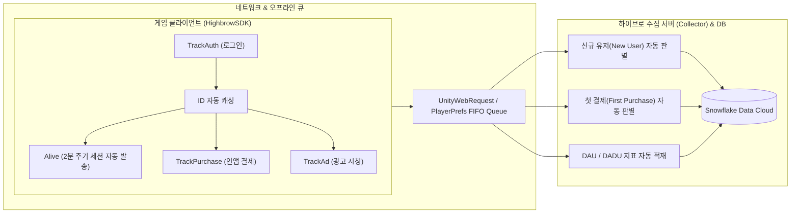

# Highbrow SDK (Unity Client) 개발사 연동 매뉴얼
> **문서 버전:** v1.0.0 (최신 패키지 기준)
> **대상 독자:** 파트너사 클라이언트 개발자, 테크니컬 디렉터(TD), QA 엔지니어
> **지원 환경:** Unity 2020.3 LTS 이상 (Unity 2021, 2022, 2023, Unity 6 완벽 지원)
> **지원 플랫폼:** Android (Google Play, ONE store, Galaxy Store), iOS (App Store), PC (Steam)

---

## 📑 목차
1. [개요 및 아키텍처 원칙](#1-개요-및-아키텍처-원칙)
2. [사전 준비 사항](#2-사전-준비-사항)
3. [1단계: 패키지 설치 (UPM)](#3-1단계-패키지-설치-upm)
4. [2단계: SDK 환경 설정](#4-2단계-sdk-환경-설정)
5. [3단계: 필수 4대 코드 연동](#5-3단계-필수-4대-코드-연동)
   - [Step 1: SDK 초기화](#step-1-sdk-초기화)
   - [Step 2: 로그인 및 유저 식별 (TrackAuth)](#step-2-로그인-및-유저-식별-trackauth)
   - [Step 3: 인앱 결제 영수증 연동 (TrackPurchase)](#step-3-인앱-결제-영수증-연동-trackpurchase)
   - [Step 4: 광고 시청 사실 연동 (TrackAd)](#step-4-광고-시청-사실-연동-trackad)
6. [4단계: (선택) 하이브로 자사 크로스 프로모션 광고 (Highbrow.Ad)](#6-4단계-선택-하이브로-자사-크로스-프로모션-광고-highbrowad)
7. [5단계: Assembly Definition (.asmdef) 설정](#7-5단계-assembly-definition-asmdef-설정)
8. [6단계: 검증 및 QA 체크리스트](#8-6단계-검증-및-qa-체크리스트)
9. [자주 묻는 질문 및 트러블슈팅 (FAQ)](#9-자주-묻는-질문-및-트러블슈팅-faq)
10. [기술 지원 및 문의](#10-기술-지원-및-문의)

---

## 1. 개요 및 아키텍처 원칙

`HighbrowSDK`는 하이브로 퍼블리싱 파트너사를 위한 공식 Unity 클라이언트 SDK입니다.
게임의 기존 로직을 최대한 훼손하지 않으면서 최소한의 코드 삽입(외과 수술적 연동)만으로 안정적인 데이터 파이프라인(Snowflake 연동)과 크로스 프로모션 광고를 구축할 수 있도록 설계되었습니다.



### 4대 핵심 아키텍처 원칙
1. **클라이언트 4대 팩트 로그(Fact Log) 원칙:**
   - 클라이언트는 오직 실제 발생한 사실 4가지만 기록합니다:
     - `Auth`: 로그인 완료 시점 1회
     - `Alive`: 2분 주기 세션 유지 하트비트 (자동 동작)
     - `Purchase`: 인앱 결제 완료 시점 1회
     - `Advertise`: 동영상/전면 광고 시청 완료 시점 1회
   - **신규 유저(New User), 첫 결제(First Purchase), DAU/DADU 집계 로직을 클라이언트에 구현하지 마세요.** 하이브로 중앙 수집 서버가 자체 DB를 조회하여 100% 무결하게 판별 및 적재합니다.
2. **유저 식별자 자동 캐싱 (Auto-Caching):**
   - 로그인 시 `TrackAuth`를 호출하면 `SUID`, `AccountId`, `AccountType`, `DUID`가 SDK 내부에 안전하게 캐싱됩니다.
   - 이후 결제, 광고, 세션 로그 전송 시 SUID를 다시 넘겨주지 않아도 캐시된 정보가 자동으로 주입됩니다.
3. **오프라인 큐 & 자동 재시도 (Offline Resilience):**
   - 지하철 음영 지역, 비행기 모드 등 네트워크 단절 상태에서 발생한 로그는 기기 로컬(`PlayerPrefs`)에 최대 300건까지 FIFO 큐로 보관됩니다.
   - 네트워크 연결이 복구되거나 앱으로 복귀(OnApplicationPause)할 때 백그라운드에서 안전하게 자동 재전송됩니다.
4. **2단계 자동 엔드포인트 라우팅 (2-Tier Routing):**
   - 개발 및 QA 단계: `UseSandbox = true` (샌드박스 수집 서버)
   - 상용 라이브 배포: `UseSandbox = false` (프로덕션 수집 서버)

---

## 2. 사전 준비 사항

연동을 시작하기 전에 다음 항목을 준비해 주세요:
1. **하이브로 발급 `AppKey`:** 하이브로 사업/기술 담당자로부터 게임 전용 `AppKey`를 발급받았는지 확인합니다. (발급 전이라도 임시 키로 연동을 진행할 수 있습니다.)
2. **Git URL:** 패키지 설치를 위한 공식 Git 저장소 URL:
   ```text
   https://github.com/HighbrowGame/HighbrowSDK-Partner.git
   ```

---

## 3. 1단계: 패키지 설치 (UPM)

Unity Package Manager(UPM)를 통해 1분 만에 설치할 수 있습니다.

### 방법 1. Unity Package Manager GUI로 설치 (권장)
1. Unity Editor 상단 메뉴에서 **Window** > **Package Manager**를 엽니다.
2. 좌측 상단의 **`+` 버튼**을 클릭하고 **Add package from git URL...**을 선택합니다.
3. 아래 URL을 붙여넣고 **Add** 버튼을 클릭합니다:
   ```text
   https://github.com/HighbrowGame/HighbrowSDK-Partner.git
   ```
4. Unity가 패키지를 다운로드하고 컴파일을 완료하면 상단 메뉴에 **`Highbrow`** 메뉴가 생성됩니다.

### 방법 2. `Packages/manifest.json` 파일에 직접 등록
프로젝트 루트의 `Packages/manifest.json` 파일을 열고, `dependencies` 객체 내에 다음 한 줄을 추가합니다:
```json
{
  "dependencies": {
    "com.highbrow.sdk": "https://github.com/HighbrowGame/HighbrowSDK-Partner.git",
    "...": "..."
  }
}
```

---

## 4. 2단계: SDK 환경 설정

SDK 설정은 **Unity 인스펙터 GUI 설정**과 **C# 스크립트 코드 설정** 2가지 방식을 모두 지원합니다.

### 방법 A. Unity Inspector GUI 설정 (가장 간편한 권장 방식)
1. Unity 상단 메뉴에서 **`Highbrow` > `SDK Settings`**를 클릭합니다.
2. `Assets/Resources/Highbrow/HighbrowSettings.asset` 파일이 자동 생성되며 인스펙터에 열립니다.
3. 아래 설정값을 입력합니다:

| 설정 항목 | 설명 | 권장값 |
| :--- | :--- | :--- |
| **AppKey** | 하이브로에서 발급받은 게임 고유 앱 키 | 발급받은 키 문자열 입력 |
| **UseSandbox** | 개발/테스트 시 `true`, 상용 배포 시 `false` | 개발 중 체크, 출시 시 해제 |
| **Region** | 서버 리전 코드 | `"kr"` (기본값) |
| **Market** | 배포 타겟 스토어 (`None`, `GooglePlay`, `AppleStore`, `OneStore`, `Steam` 등) | `None` (런타임 자동 감지) |
| **CustomCountry** | 특정 국가 강제 고정 시 2자리 ISO 코드 (예: "KR", "US") | 비워둠 (단말기 언어/지역 자동 감지) |
| **EnableLog** | 로그 수집 모듈 활성화 여부 | `true` (체크) |
| **EnableAd** | 자사 광고 모듈 활성화 여부 | `true` (체크) |
| **AutoSessionTracking**| 2분 주기 세션 하트비트(Alive) 자동 발송 여부 | `true` (체크) |
| **SessionIntervalSeconds**| 세션 하트비트 주기 (최소 120초 보장) | `120` |
| **HttpTimeoutSeconds**| HTTP 통신 타임아웃 (3초~30초 자동 클램프) | `10` |
| **DebugMode** | Unity 콘솔에 SDK 내부 상세 로그 출력 여부 | 개발 시 체크, 상용 출시 시 해제 |

> 💡 **Tip:** GUI 설정을 완료해 두면, 인게임 스크립트에서는 매개변수 없이 `HighbrowSDK.Initialize();` 단 한 줄로 초기화할 수 있습니다.

---

### 방법 B. C# 스크립트 코드 기반 동적 설정
스토어 빌드별 전처리기(Preprocessor) 분기나 런타임 동적 설정이 필요한 경우 코드로 직접 생성하여 전달할 수 있습니다:

```csharp
using Highbrow.Core;
using Highbrow.Log;
using UnityEngine;

public static class HighbrowSetup
{
    public static HighbrowConfig CreateConfig()
    {
        // 타겟 스토어 동적 분기
        MarketType targetMarket = MarketType.None;
#if UNITY_IOS
        targetMarket = MarketType.AppleStore;
#elif UNITY_ANDROID
    #if ONESTORE || ONE_STORE
        targetMarket = MarketType.OneStore;
    #elif SAMSUNG || SAMSUNG_STORE || GALAXY_STORE
        targetMarket = MarketType.SamsungStore;
    #else
        targetMarket = MarketType.GooglePlay;
    #endif
#elif UNITY_STANDALONE_WIN
        targetMarket = MarketType.Steam;
#endif

        return new HighbrowConfig
        {
            AppKey = "YOUR_HIGHBROW_APP_KEY",     // 하이브로 발급 AppKey
            Market = targetMarket,                 // 타겟 스토어
            ClientVersion = Application.version,    // 클라이언트 버전 (null 시 Application.version 자동 사용)
            UseSandbox = false,                    // false: 상용 라이브 배포, true: 샌드박스 개발/테스트
            Region = "kr",                          // 서버 리전
            EnableLog = true,
            AutoSessionTracking = true,            // 2분 주기 세션 하트비트 자동 활성화
            SessionIntervalSeconds = 120f,
            HttpTimeoutSeconds = 10,
            DebugMode = false                      // 상용 빌드 시 false
        };
    }
}
```

---

## 5. 3단계: 필수 4대 코드 연동

총 4개의 지점에 코드를 삽입합니다.

---

### Step 1: SDK 초기화
게임 시작 씬(최초 부트스트랩, 타이틀 매니저, 스플래시 화면 등)의 `Awake()` 또는 `Start()`에서 1회 호출합니다.

```csharp
using Highbrow.Core;
using UnityEngine;

public class TitleSceneManager : MonoBehaviour
{
    private void Awake()
    {
        // 방법 A: 인스펙터 설정(Highbrow > SDK Settings)을 사용할 때 (권장)
        HighbrowSDK.Initialize();

        // 또는 방법 B: 코드로 생성한 config를 직접 전달할 때
        // HighbrowSDK.Initialize(HighbrowSetup.CreateConfig());
    }
}
```

> **성공 확인:** 게임 실행 시 Unity 콘솔창에 아래와 같은 로그가 1회 출력되면 정상 초기화된 것입니다:
> `[HighbrowSDK] Initialized v1.0.0 successfully. (Mode: PROD, Market: GooglePlay, Country: KR)`

---

### Step 2: 로그인 및 유저 식별 (TrackAuth)
유저가 소셜(구글, 애플 등) 또는 게스트 로그인을 완료한 성공 콜백 시점에 호출합니다.

```csharp
using Highbrow.Log;

// 로그인 성공 콜백
public void OnLoginSuccess(string userUid, string socialSubId, string userNickname)
{
    // Highbrow 인증 로그 전송 (SUID 및 디바이스 ID 자동 캐싱 & 1초 후 2분 주기 Alive 자동 시작)
    HighbrowLog.TrackAuth(
        suid: userUid,                       // 게임 유저 고유 ID (문자열) - [필수!]
        accountId: socialSubId,               // 구글 sub ID, 애플 user ID 등
        accountType: AccountType.GooglePlay,  // AccountType 열거형 지정
        nickname: userNickname,               // 유저 닉네임 (없으면 string.Empty)
        result: "OK"                          // 인증 결과 (기본값 "OK")
    );

    // (선택 사항) 게임 서버에서 판정한 국가 코드가 있다면 오버라이드 가능:
    // HighbrowLog.SetCountry("KR");
}
```

#### `AccountType` 매핑 가이드
| 로그인 수단 | `AccountType` Enum 값 | 설명 |
| :--- | :--- | :--- |
| **구글 플레이 게임즈** | `AccountType.GooglePlay` (2) | Android Google 로그인 |
| **애플 ID (Sign in with Apple)** | `AccountType.AppleId` (5) | iOS Apple ID 로그인 |
| **애플 게임센터** | `AccountType.AppleGameCenter` (1) | GameCenter 인증 |
| **게스트 (Guest)** | `AccountType.Guest` (9) | 계정 연동 없는 기기 로컬 게스트 |
| **페이스북** | `AccountType.Facebook` (3) | Facebook 소셜 로그인 |
| **스팀** | `AccountType.Steam` (4) | PC Steam 계정 로그인 |

> ⚠️ **주의사항:**
> 1. `suid`는 유저를 식별하는 핵심 키입니다. null이거나 빈 문자열(`""`)이면 통계 지표가 왜곡되므로 반드시 고유 ID를 전달해야 합니다.
> 2. `TrackAuth`가 성공적으로 호출되면 1초 뒤부터 **2분 주기 세션 유지 하트비트(`Alive`) 로그가 백그라운드에서 자동 전송**됩니다.
> 3. **로그아웃/계정 전환 시:** 유저가 로그아웃하거나 타이틀 화면으로 돌아갈 때는 `HighbrowLog.ClearUser();`를 호출하여 세션 타이머를 중지하고 캐시를 초기화하세요.

---

### Step 3: 인앱 결제 영수증 연동 (TrackPurchase)
인앱 상품 결제가 성공하고 영수증 검증이 완료된 콜백 시점에 호출합니다.

#### Case A. Unity IAP (`IStoreListener.ProcessPurchase`) 사용 시
```csharp
using Highbrow.Log;
using UnityEngine.Purchasing;

public PurchaseProcessingResult ProcessPurchase(PurchaseEventArgs args)
{
    // 1. 기존 게임 결제/아이템 지급 로직 유지...

    // 2. Highbrow 결제 로그 전송
    HighbrowLog.TrackPurchase(
        receiptId: args.purchasedProduct.transactionID,            // 중요: 스토어 트랜잭션 ID 전달
        originalPrice: (float)args.purchasedProduct.metadata.localizedPrice, // 결제 금액
        priceId: args.purchasedProduct.definition.id,             // 스토어 등록 인앱 SKU
        currency: args.purchasedProduct.metadata.isoCurrencyCode, // 스토어 결제 통화 ("KRW", "USD" 등)
        productId: 0,                                             // (선택) 게임 내부 숫자 상품 ID
        productName: args.purchasedProduct.metadata.localizedTitle// (선택) 상품 표시 이름
    );

    return PurchaseProcessingResult.Complete;
}
```

#### Case B. 자체 게임 서버 영수증 검증을 사용하는 경우
```csharp
using Highbrow.Log;

// 게임 서버 영수증 검증 완료 콜백
public void OnServerPurchaseVerified(string storeTransactionId, float price, string storeSku, string currencyCode, string itemName)
{
    // Highbrow 결제 로그 전송
    HighbrowLog.TrackPurchase(
        receiptId: storeTransactionId, // 구글 주문번호(GPA.xxxx) 또는 애플 transactionID
        originalPrice: price,
        priceId: storeSku,
        currency: currencyCode,        // ISO 4217 통화 코드 ("KRW", "USD" 등)
        productName: itemName
    );
}
```

> ⚠️ **결제 연동 핵심 주의사항:**
> 1. **`receiptId`에 raw JSON 전달 금지:** `args.purchasedProduct.receipt` (수 KB 크기의 base64 암호화 전문)을 그대로 넣으면 SDK에서 유효성 검사 오류로 차단됩니다. 반드시 **`args.purchasedProduct.transactionID`** (예: Google Order ID `GPA.xxxx-xxxx-xxxx-xxxxx` 또는 Apple 트랜잭션 번호)를 전달하세요.
> 2. **미처리 결제 복구(Pending/Restore) 시점:** `TrackPurchase`는 유저 식별(`TrackAuth`)이 완료된 이후에만 정상 수집됩니다. 앱 기동 시 발생하는 미처리 결제 복구 처리는 반드시 **유저 로그인 완료 이후에 수행**되도록 순서를 맞추어 주세요.

---

### Step 4: 광고 시청 사실 연동 (TrackAd)
기존에 사용 중인 광고 미디에이션(AppLovin MAX, IronSource, AdMob, Unity Ads 등)의 시청 완료 콜백에 호출합니다.

```csharp
using Highbrow.Log;

// 1. 보상형 동영상 광고 시청 완료 콜백
public void OnRewardedAdCompleted()
{
    HighbrowLog.TrackAd(AdType.RewardVideo);
}

// 2. 전면(인터스티셜) 광고 노출/완료 콜백
public void OnInterstitialAdClosed()
{
    HighbrowLog.TrackAd(AdType.Interstitial);
}

// 3. 배너 광고 노출 콜백
public void OnBannerAdLoaded()
{
    HighbrowLog.TrackAd(AdType.Banner);
}
```

---

## 6. 4단계: (선택) 하이브로 자사 크로스 프로모션 광고 (Highbrow.Ad)

하이브로 자사 게임(드래곤빌리지 시리즈 등)의 크로스 프로모션 동영상 광고를 송출하고자 할 때 사용합니다.
보상형 광고 No-Fill 폴백 처리나 인게임 크로스 프로모션 배너/버튼 클릭 시 단 한 줄로 팝업을 띄울 수 있습니다.

```csharp
using Highbrow.Ad;
using UnityEngine;

public class AdRewardManager : MonoBehaviour
{
    public void ShowHouseAd()
    {
        HighbrowAd.Show(
            onCompleted: () =>
            {
                // 유저가 영상을 시청하고 닫기(스킵) 버튼을 클릭했을 때 호출됩니다.
                Debug.Log("광고 완료: 보상 지급 또는 게임 재개");
                GrantUserReward();
            },
            onFailed: () =>
            {
                // 네트워크 오류 등으로 광고 송출이 실패했을 때 호출됩니다.
                Debug.LogWarning("광고 송출 실패: 대체 안내 팝업 노출");
            }
        );
    }
}
```

> ⚠️ **중요 (EventSystem 필수):**
> 광고 팝업 내의 닫기(스킵), 음소거 토글, 스토어 이동 버튼 상호작용을 위해, 해당 씬에 Unity **EventSystem**이 활성화되어 있어야 합니다.

---

## 7. 5단계: Assembly Definition (.asmdef) 설정

프로젝트의 스크립트들이 커스텀 Assembly Definition(`.asmdef`)으로 분리되어 있는 경우, `Highbrow` 네임스페이스를 참조할 수 있도록 설정해야 합니다.

1. 프로젝트 창에서 연동 코드가 작성된 스크립트의 `.asmdef` 파일을 선택합니다.
2. Inspector 창의 **Assembly Definition References** 항목에 아래 모듈을 추가합니다:
   - **`Highbrow.Core`** (필수)
   - **`Highbrow.Log`** (필수)
   - **`Highbrow.Ad`** (자사 크로스 프로모션 광고 사용 시)
3. Inspector 우측 하단의 **Apply**를 클릭합니다.

---

## 8. 6단계: 검증 및 QA 체크리스트

### 1. Unity 콘솔 로그 확인
Unity Editor에서 Play Mode를 시작했을 때 콘솔창에 다음 로그가 출력되는지 확인합니다:
```text
[HighbrowSDK] Initialized v1.0.0 successfully. (Mode: PROD, Market: GooglePlay, Country: KR)
```

### 2. 에디터 진단 도구 활용
상단 메뉴의 **`Highbrow`** 서브 메뉴를 통해 연동 상태를 즉시 점검할 수 있습니다:
- **`Highbrow > Show Current SDK Status`**: 현재 SDK 초기화 상태와 동작 모드(SANDBOX / PROD)를 팝업으로 표시합니다.
- **`Highbrow > Clear Offline Log Cache (PlayerPrefs)`**: 로컬에 누적된 오프라인 재전송 로그 큐를 초기화합니다.
- **`Highbrow > Diagnose House Ad Prefab`**: 자사 광고 팝업 프리팹 리소스 인덱싱 정상 여부를 진단합니다.

### 3. HTTP 패킷 검증 (디버그 모드)
`HighbrowSettings.asset`에서 **`DebugMode = true`** 및 **`DumpHttpPayload = true`**로 설정하면, SDK가 서버로 전송하는 HTTP 요청 JSON 바디와 응답 코드가 콘솔에 실시간으로 상세 출력되어 전송 데이터를 육안으로 검증할 수 있습니다.

### 4. QA 체크리스트

| 검증 항목 | 테스트 절차 | 기대 결과 | 확인 여부 |
| :--- | :--- | :--- | :---: |
| **SDK 초기화** | 앱 시작 씬 진입 | `[HighbrowSDK] Initialized...` 로그 1회 출력 | [ ] |
| **로그인 연동** | 구글/애플/게스트 로그인 완료 | `POST /v1/log/auth` 전송 확인 (SUID 유효값 확인) | [ ] |
| **세션 하트비트** | 로그인 후 2분 이상 게임 플레이 | 2분 주기마다 `POST /v1/log/alive` 주기적 전송 확인 | [ ] |
| **인앱 결제** | 테스트 결제 완료 | `POST /v1/log/purchase` 전송 (transactionID, price, currency) | [ ] |
| **광고 시청** | 동영상/전면 광고 완료 | `POST /v1/log/ad` 전송 (adType 확인) | [ ] |
| **오프라인 큐** | 비행기 모드에서 결제/로그 후 네트워크 재연결 | 로컬 캐싱 후 재연결 시 누락 없이 자동 일괄 전송 | [ ] |
| **상용 모드 전환** | 최종 릴리즈 빌드 전 `UseSandbox = false` 확인 | 프로덕션 수집 서버(`log-api.highbrow-inc.com`)로 전송 | [ ] |

---

## 9. 자주 묻는 질문 및 트러블슈팅 (FAQ)

### Q1. 통신이 끊기면 유저의 결제나 로그인 로그가 유실되나요?
**아닙니다.** HighbrowSDK는 자체 오프라인 큐를 내장하고 있습니다. 네트워크 단절이나 일시적 서버 장애 발생 시 로그는 `PlayerPrefs`에 즉시 FIFO 큐로 보존되며, 네트워크 복구 또는 앱 복귀 시 자동으로 재전송됩니다.

### Q2. 신규 유저(New User), 첫 결제(First Purchase), DAU 로그는 왜 클라이언트에서 전송하지 않나요?
모바일 클라이언트 단에서는 앱 재설치, 기기 변경, 스토어 계정 전환 등의 상황에서 해당 유저가 '진짜 신규 유저'인지 '첫 결제 유저'인지 100% 무결하게 판별하기 어렵습니다.
따라서 Highbrow 시스템은 **클라이언트는 오직 일어난 사실(인증, 결제)만 전송**하고, **중앙 수집 서버가 전체 유저 DB를 조회하여 신규 및 첫 결제 여부를 서버에서 자동 판정**하도록 설계되었습니다. 개발사는 이에 대한 부가 코드를 작성할 필요가 없습니다.

### Q3. `receiptId`에 영수증 전문(raw JSON)을 넣으면 왜 안 되나요?
영수증 전문(raw JSON)은 데이터 크기가 크고 플랫폼별 스키마가 상이하여 분석 효율을 저하시킵니다. 데이터 파이프라인(Snowflake)에서는 고유 거래 번호인 스토어 트랜잭션 ID(`GPA.xxxx` 또는 `transactionID`)를 기본 식별자로 관리하므로, 원시 JSON 대신 트랜잭션 ID를 전달해야 합니다.

### Q4. `SUID`는 어떤 값을 넘겨야 하나요?
게임 백엔드 데이터베이스에서 해당 유저를 식별하는 **고유 유저 시퀀스/UUID(문자열)**를 넘겨주셔야 합니다. 기기 ID(DUID)나 닉네임을 넘기지 마세요.

### Q5. 백그라운드 스레드(Task/async)에서 호출해도 안전한가요?
**안전합니다.** HighbrowSDK는 `PreWarm` 캐싱과 메인 스레드 자동 디스패처(`HighbrowDispatcher`)를 내장하고 있어, 백그라운드 워커 스레드에서 `TrackAuth`, `TrackPurchase` 등을 호출하더라도 Unity Main Thread 예외 없이 안전하게 동작합니다.

### Q6. 크로스 프로모션 광고(`HighbrowAd.Show`)의 닫기/스킵 버튼이 클릭되지 않습니다.
해당 씬의 Hierarchy에 **EventSystem** GameObject가 활성화되어 있는지 확인하세요. Unity uGUI의 모든 버튼 클릭 이벤트는 EventSystem을 필요로 합니다.

### Q7. 빌드 시 `CS0246: The type or namespace name 'Highbrow' could not be found` 에러가 발생합니다.
연동 코드가 작성된 스크립트가 커스텀 `.asmdef` 폴더 안에 위치해 있는 경우 발생합니다. 해당 `.asmdef` 파일의 **Assembly Definition References**에 `Highbrow.Core` 및 `Highbrow.Log`를 추가해 주세요. (본 문서 7단계 참조)

---

## 10. 기술 지원 및 문의

연동 과정에서 의문점이 있거나 이슈가 발생할 경우 아래 창구로 문의해 주시면 즉시 지원해 드립니다.

- **기술 지원 및 AppKey 발급 문의:** `kms@highbrow.com`
- **최신 저장소:** [HighbrowSDK-Partner GitHub](https://github.com/HighbrowGame/HighbrowSDK-Partner)
